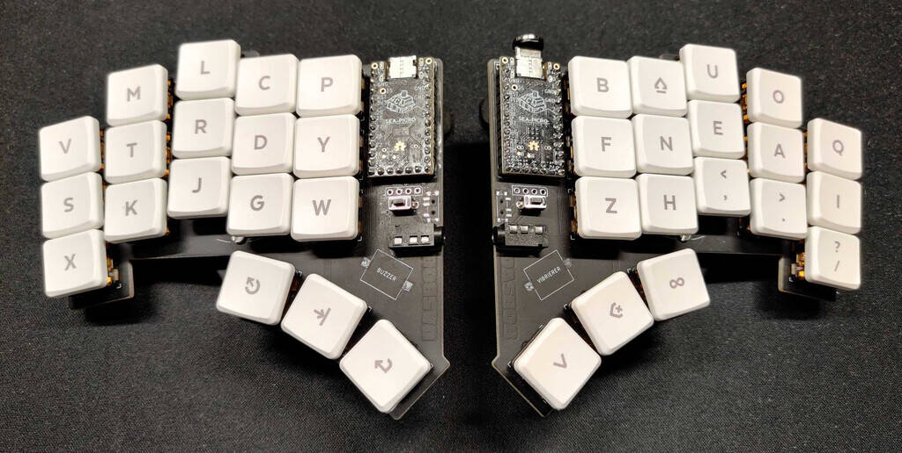

# dasbob



---

DASBOB is a 36-key diodeless split with splay and buzzer.

- Keyboard Maintainer: [grooovebob](https://github.com/grooovebob)
- Hardware Supported: elite c
- Hardware Availability: https://github.com/GroooveBob/DASBOB

---

## PandaScience Adaption

### Fixes

- Cleaned up superfluous configuration in `rules.mk` and `config.h`
- Fixed relative key positions in `info.json`

### Features

- [Magic Sturdy alphas](https://github.com/Ikcelaks/keyboard_layouts/blob/main/magic_sturdy/magic_sturdy.md)
- Symbol, navigation and function layers
- Combo shortcuts for frequent symbols
- Home row mods
- Swap hands key
- Auto-shift
- Automated keymap drawing

### Keymap

> [!TIP]
> Keymap SVG created with [Keymap Drawer](https://github.com/caksoylar/keymap-drawer)

> [!NOTE]
>
> - Symbols with existing combos on BSE layer are indicated on SYM layer with a
>   lighter grey shading
> - SYS layer is WIP


## Setup

```
sudo pacman -S qmk (+ optional deps)
qmk setup
sudo cp /path/to/qmk_firmware/util/udev/50-qmk.rules /etc/udev/rules.d/
qmk config user.keyboard=crkbd/rev1
qmk config user.keymap=pandascience
qmk new-keymap
qmk compile

# for auto-detecting left/right side via EEPROM flash side-specific firmware
qmk flash -kb dasbob -km default -bl uf2-split-left
qmk flash -kb dasbob -km default -bl uf2-split-right
# then for subsequent updates it's sufficient to run
qmk flash
```
